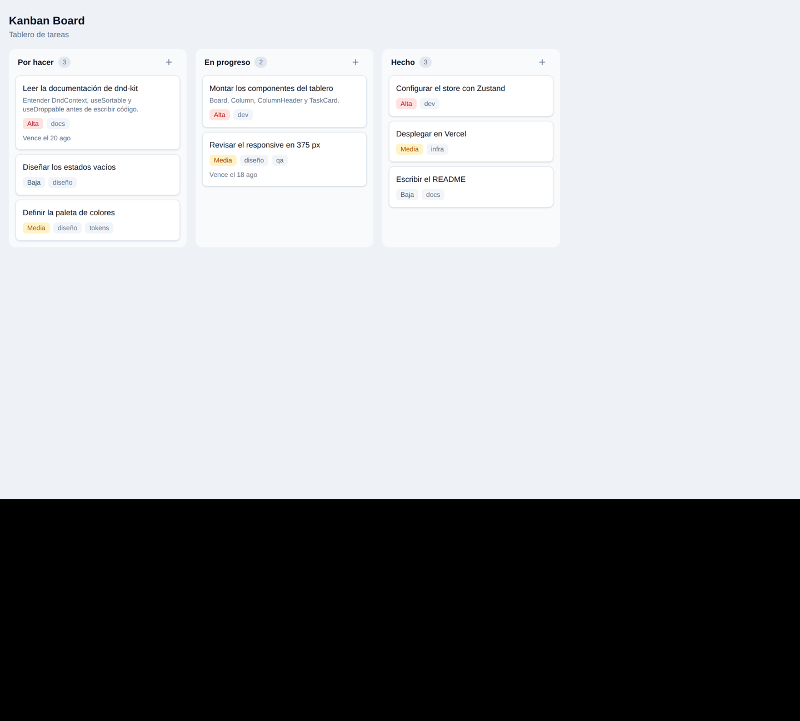
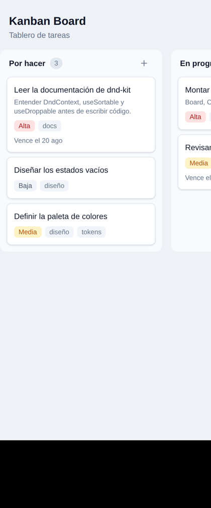

# Kanban Board

Tablero de tareas en columnas, con arrastrar y soltar, búsqueda y filtros.
Aplicación **100 % frontend**: el estado se guarda en el navegador, sin backend ni base de datos.

**Demo:** https://kanban-board-rous1.vercel.app

## Capturas

### Escritorio



### Móvil

Las columnas quedan en scroll horizontal con ajuste por columna.



## Stack

| Área          | Herramienta                            |
| ------------- | -------------------------------------- |
| Build tool    | Vite                                   |
| Lenguaje      | TypeScript                             |
| UI            | React 19, solo componentes funcionales |
| Estado global | Zustand con middleware `persist`       |
| Estilos       | TailwindCSS v4                         |
| Drag & drop   | `@dnd-kit/core` y `@dnd-kit/sortable`  |
| Iconos        | lucide-react                           |
| Formato/Lint  | ESLint + Prettier                      |
| Hosting       | Vercel, con despliegue automático      |

## Cómo correr en local

```bash
npm install
npm run dev
```

La app queda en http://localhost:5173

## Scripts

| Comando          | Qué hace                    |
| ---------------- | --------------------------- |
| `npm run dev`    | Servidor de desarrollo      |
| `npm run build`  | Compila para producción     |
| `npm run lint`   | Revisa el código con ESLint |
| `npm run format` | Formatea con Prettier       |

## Estructura

```
src/
├── components/
│   ├── board/      Board, Column, ColumnHeader, TaskCard
│   └── ui/         primitivos reutilizables: Button, Badge
├── store/          useBoardStore
├── types/          Task, Column, BoardState, Priority
├── lib/            constants.ts y utils.ts
├── App.tsx
└── main.tsx
```

## Decisiones técnicas

**La lógica antes que la interfaz.** Todo el store se construyó y se probó desde la consola del navegador antes de escribir un solo componente. El store no sabe que React existe: no conoce clics, ni modales, ni colores. Eso permite rediseñar la interfaz sin tocar la lógica, y probar la lógica sin interfaz.

**El store no valida ni pregunta.** La regla de negocio dice que no se puede eliminar una columna con tareas sin confirmación del usuario. Esa confirmación vive en la interfaz (`ConfirmDialog`), no en el store. Si la pregunta estuviera dentro del store dejaría de ser lógica pura y no podría probarse aisladamente.

**Inmutabilidad en todas las acciones.** Nunca se usa `push` ni `splice` sobre el estado guardado: siempre se crean copias nuevas con el operador de propagación. React detecta cambios comparando referencias, no contenido; mutar el array existente haría que la interfaz no se actualizara, y sin ningún error que lo delatara.

**`order` normalizado siempre.** Después de cada borrado o movimiento, las posiciones se renumeran de forma consecutiva desde 0 dentro de cada columna. Un hueco en la numeración no rompe nada de inmediato, pero vuelve frágil cualquier cálculo posterior de posiciones.

**Selectores atómicos.** Los componentes consumen el store con `useBoardStore((s) => s.columns)` en lugar de pedirlo entero, para que cada uno se redibuje solo cuando cambia la parte que le interesa.

**Tokens de color en `@theme`.** La paleta se define en `src/index.css` dentro del bloque `@theme` de Tailwind v4, y los componentes usan nombres semánticos (`bg-tablero`, `text-suave`, `bg-alta-suave`). No hay valores hexadecimales sueltos en los componentes.

**Clases de Tailwind escritas completas.** Las variantes de color se resuelven con mapas explícitos (`TONOS`, `VARIANTES`) en vez de construir el nombre de la clase al vuelo. Tailwind analiza el código como texto para decidir qué clases genera; una clase compuesta dinámicamente no llegaría a existir.

**La prioridad no se comunica solo con color.** Cada tarjeta muestra la palabra «Alta», «Media» o «Baja» junto al color, para que la información siga siendo legible sin distinguir tonos.

**HTML con significado.** El tablero usa `<section>` para cada columna, `<header>` para su encabezado, `<ul>`/`<li>` para la lista de tarjetas y `<article>` para cada tarjeta. Los botones de solo icono llevan `aria-label`.

**Fechas guardadas como texto ISO.** `localStorage` solo almacena texto, así que `dueDate` y `createdAt` se guardan en formato ISO 8601 y se formatean al mostrarlos.

**La clave de persistencia lleva versión** (`kanban-board-v1`). Si la forma de los datos cambia, basta con subir la versión para que lo guardado con el formato antiguo deje de cargarse en vez de romper la aplicación.

## Proceso

Cada etapa se desarrolla en su propia rama, se abre un Pull Request con sus criterios de aceptación, y se fusiona a `main` solo cuando todos se cumplen. `main` está siempre desplegable: cada fusión dispara un despliegue automático en Vercel, y cada Pull Request genera una URL de vista previa.

Los commits siguen la convención de Conventional Commits (`feat:`, `fix:`, `refactor:`, `style:`, `docs:`, `chore:`), con un commit por cambio lógico.

| Etapa                         | Estado     |
| ----------------------------- | ---------- |
| 0 · Setup del proyecto        | Completada |
| 1 · Estado global con Zustand | Completada |
| 2 · UI estática               | Completada |
| 3 · CRUD completo             | Pendiente  |
| 4 · Drag & drop               | Pendiente  |
| 5 · Búsqueda y filtros        | Pendiente  |
| 6 · Pulido y accesibilidad    | Pendiente  |
| 7 · Bonus                     | Opcional   |
